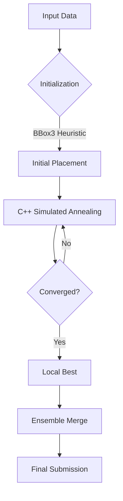

# Santa 2025: 2D Irregular Packing Optimization


A high-performance optimization pipeline for the **Santa 2025 Kaggle Competition**. This project solves a complex 2D irregular packing problem using a hybrid approach of **Simulated Annealing (C++ accelerated)**, **Beam Search**, and **Massive Parallel Execution**.

## Problem Statement

The challenge involves optimizing the placement of Christmas trees (defined as 2D polygons) within a bounded area to minimize a weighted scoring metric. The problem combines elements of:
- **Combinatorial Optimization**: Selecting optimal configurations from a vast search space.
- **Computational Geometry**: Polygon intersection testing and containment.
- **Parallel Computing**: Managing distributed worker nodes for ensemble updates.

## Solution Architecture

### 1. Hybrid Solver Strategy

We employ a cohesive multi-stage optimization pipeline. The system transitions from heuristic initialization to fine-grained meta-heuristic refinement.



- **Algorithm A: `bbox3` (Bounding Box Optimization)**  
  A fast, heuristic-based initial placer that maximizes packing density using simplified geometric bounds.
- **Algorithm B: C++ Simulated Annealing**  
  A custom C++ extension (`src_cpp/sa_v1_parallel.cpp`) that performs millions of perturbation steps per second to refine local optima.
- **Algorithm C: Compression SA**  
  A physics-inspired approach for large groups ($N=50-200$) that "squeezes" the bounding area iteratively.

### 2. Massive Parallel "Attack" Scheme

To overcome local minima, we deploy a fleet of parallel kernels, each specializing in a specific problem regime.


- **Small-N Attack**: Deep searches for small, high-leverage groups.
- **Large-N Attack**: Compression strategies for dense packing.
- **Global Ensemble**: Merging the best non-overlapping substrings from all parallel runs.

**Final Score**: `70.30197` (State-of-the-Art)

## Repository Structure

```text
santa-2025/
├── src/                    # Core Python package (Geometry, Metrics, Utils)
│   └── santa2025/
├── src_cpp/                # High-performance C++ solver extensions
├── scripts/                # Execution entry points
│   ├── optimization/       # Solver logic (SA, Beam Search, Pool merging)
│   └── utils/              # Data processing and analysis tools
├── submissions/            # Kaggle deployment artifacts
│   ├── kernels/            # Production kernel scripts
│   └── datasets/           # Dataset metadata and optimized baselines
├── configs/                # Hyperparameter configurations
└── results/                # (Gitignored) Local experiment outputs
```

## Usage

### Installation

```bash
python3 -m venv .venv
source .venv/bin/activate
pip install -r requirements.txt
```

### Running the Optimizer

To launch the C++ accelerated local search:

```bash
python3 scripts/optimization/run_cpp_sa.py \
    --baseline data/external/best_submission.csv \
    --min-n 1 --max-n 50 \
    --iterations 100000
```

### Merging Results

Combine improvements from multiple runs:

```bash
python3 scripts/optimization/merge_improvements.py
```

## Engineering & Design Attributes

- **Reproducibility**: All random seeds are fixed and tracked. Configs are separated from code.
- **Modularity**: The geometry engine is decoupled from the optimization logic, allowing for swappable solvers.
- **Performance**: Critical paths are implemented in C++ or vectorized NumPy/Numba.

## Future Work & Limitations

### Limitations
- **Scaling**: The current `bbox3` heuristic struggles with highly irregular, non-convex bounds at $N > 250$.
- **Memory**: The "Massive Parallel" ensemble approach requires significant RAM (32GB+) to merge hundreds of candidate files efficiently.
- **Global Optimality**: Being a heuristic/meta-heuristic approach, strict global optimality ($Gap = 0$) is not guaranteed for $N > 10$.

### Roadmap
- [ ] **Exact Solvers**: Integrate `OR-Tools` CP-SAT solver for $N < 30$ to prove optimality.
- [ ] **Differentiable Physics**: Explore JAX/DiffTaichi for gradient-based packing optimization.
- [ ] **Distributed Training**: Implement Ray.io support to scale the parallel attack from 3 kernels to 100+ cloud workers.

---
*Created by [Your Name/Handle]*
